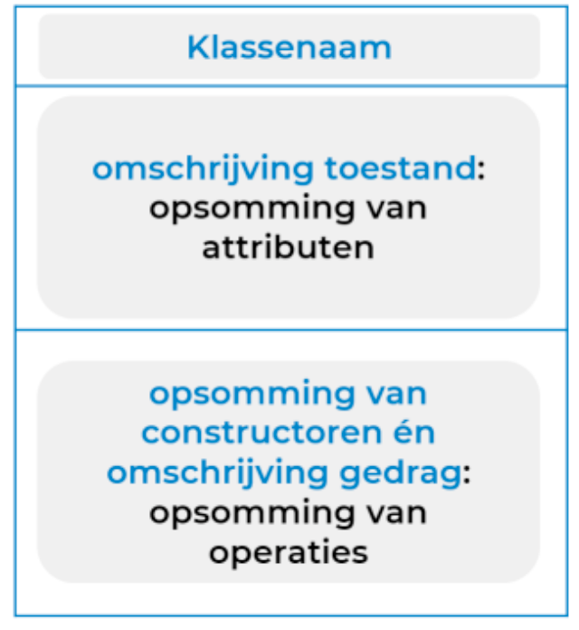
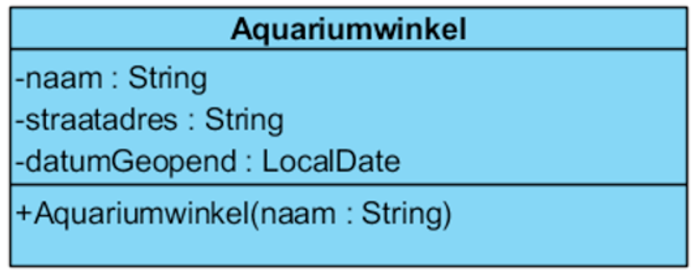
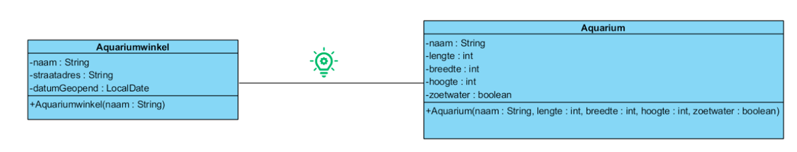
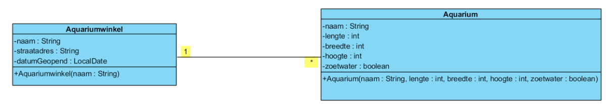
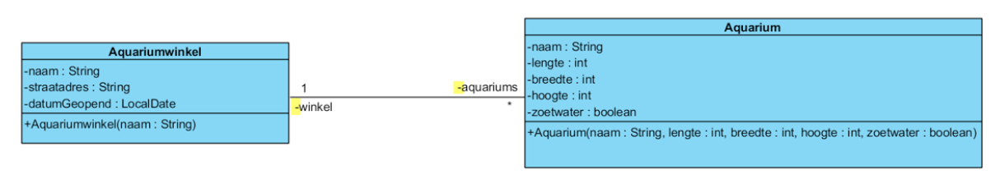
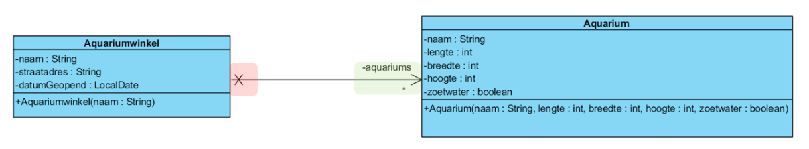
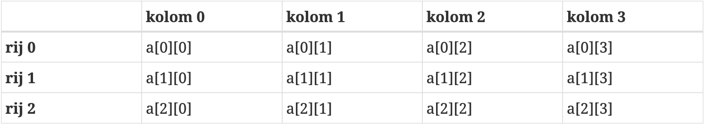
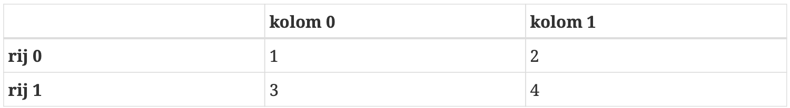
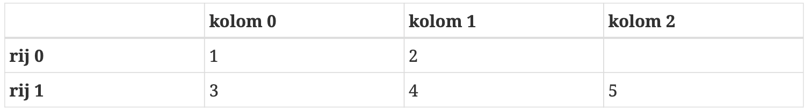

# Samenvatting OOSD (sem 1)

## 1. Basis Java

### 1.1 Waarden afdrukken in de CUI

```Java
System.out.println("Welcome to Java programming");
```

> In `Strings` kan je speciale karakters gebruiken zoals:
>
> - `\n` newline = harde return
> - `\t` horizontale tab
> - `\r` carriage return
> - `\\` levert 1 backslash op
> - `\"` levert de dubbele quote op

```Java
System.out.printf("%d artikels over", aantal)
```

> In `Sysout.printf` kunnen we makkelijk variabelen in `Strings` toevoegen.
>
> - `%s` string
> - `%S` string in hoofdletters
> - `%d` integer
> - `%n` new line
> - `%f` float
> - `%15` lengte reserveren, in dit geval 15 characters
> - `%.2f` afronden op 2 getallen na de komma

### 1.2 Rekenkundige bewerkingen

In Java kunnen we op veel plekken rekenkundige bewerkingen gebruiken.

> - `*` vermenigvuldigen
> - `/` delen
> - `+`, `-` optellen en aftrekken
> - `%` restoperator

Bij het delen wordt alles achter de komma afgekapt. Men kan wel met de restoperator de rest berekenen. We kunnen ook haakjes gebruiken om prioriteiten te stellen.

## 2. Selectiestructuren

### 2.1 De `if` selectiestructuur

Het statement wordt alleen uitgevoerd als de voorwaarde WAAR is. Hiervoor hebben we enkele vergelijkingsoperatoren.

> - `==` exact gelijk
> - `!=` verschillend
> - `>`, `<` groter dan, kleiner dan
> - `>=` groter dan of gelijk aan
> - `<=` kleiner dan of gelijk aan

### 2.2 De `if else` selectiestructuur

Deze selectiestructuur is zeer gelijkaardig aan de gewone `if`-structuur, maar voert ook een stuk code uit wanneer de voorwaarde van de `if` structuur niet `true` is.

### 2.3 De conditionele operator

Wordt vaak gebruikt bij een `print` statement. Zo kan men compact een vergelijking schrijven.

- `statement`?`true`:`false`

```Java
System.out.printf("%s gelijk", a==b?"wel":"niet");
```

### 2.4 De `switch` meervoudige selectiestructuur

Met de `switch` structuur kunnen we makkelijk meervoudige selecties maken.

We vergelijken steeds de variabele tussen de haken met de labels bij iedere case. Als er niets voldoet, vallen we terug op `default`. Een `break` is daar optioneel, omdat het de laatste is en alle code uitvoert tot de closing bracket.

```Java
switch (variable) {
    case label1: statement1
                break;
    case label2: statement2
                break;
    case label3: statement3
                break;
    default: statement4
                (break;)
}
```

## 3. Herhalingsstructuren

### 3.1 De `while` herhalingsstructuur

Dit codeblock blijft uitgevoerd worden zolang de voorwaarde `true` is (ev. met teller).

```Java
while(voorwaarde) {
    //code
}
```

Een voorbeeld:

```Java
int teller = 0;
while (teller > 100) {
    System.out.printf("Waarde %d", teller);
    teller++;
}
```

### 3.2 De `for` lus

Een `for` lus is eigenlijk een compactere versie van de `while` herhalingsstructuur.

```Java
for(controlevariabele; voorwaarde; increment) {
    //code
}
```

Een voorbeeld:

```Java
for(int teller = 0; teller>=10; teller++) {
    //code
}
```

### 3.3 De `while` lus met schildwacht

Dit is eigenlijk exact hetzelfde als de gewone `while` lus, maar hier gebruiken we een schildwacht. De code zal dus blijven uitgevoerd worden tot men de waarde van de schildwacht ingeeft. Zie onderstaand voorbeeld:

```Java
while (punt != -1) {
    totaal = totaal + punt;
    puntenTeller = puntenTeller + 1;
    System.out.print("Geef score (/20) of -1 om te stoppen: ");
    punt = input.nextInt();
}
```

### 3.4 De `do while` lus

Deze lus lijkt op de `while` lus, met het grote verschil dat hij pas na het 1ste keer doorlopen van de code de voorwaarde controleert. Bij de gewone `while` lus controleert hij eerst de voorwaarde.

```Java
do {
    //code
}while(voorwaarde);
```

Een voorbeeld:

```Java
do {
    System.out.print("Geef een strikt positief geheel getal in: ")
    getal = input.nextInt();
} while (getal <=0);
```

### 3.4 **Samenvatting**

- Je gebruikt een `for` of een `while` indien je van tevoren weet om hoeveel herhalingen het gaat.
- Weet je niet van tevoren om hoeveel herhalingen het gaat, dan dien je een `while` of een `do-while` te gebruiken.
  - Je kiest voor een `while` indien de body van de while misschien nooit mag worden uitgevoerd.
  - Je kiest voor een `do-while` indien de body van de `do-while` tenminste één keer moet worden uitgevoerd.

## 4. Samengestelde toekennings-, increment- en decrementoperatoren

### 4.1 Samengestelde toekenningsoperatoren

In Java kunnen we in bepaalde situaties uitdrukkingen voor toekenningen afkorten.

```Java
x = x operator a
wordt
x operator= a;
```

Voorbeeld:

```Java
x -= a; // x = x - a
x *= a; // x = x * a
```

### 4.2 Increment- en decrementoperatoren

In het bijzonder komt het vaak voor, dat een telvariabele met 1 moet verhoogd of verlaagd worden.

Dus in de plaats van:

```Java
teller += 1;
teller -= 1;
```

Gebruiken we:

```Java
teller++; //of ++teller;
teller--; //of --teller;
```

Wat is nu het verschil tussen `++teller` en `teller++`?

Bijvoorbeeld: Bij `resul1 = teller++;` wordt eerst de waarde van `teller` aan `result1` toegewezen, daarna pas verhoogt met 1. Bij `resul1 = ++teller;` zal eerst `teller` met 1 verhoogt worden en daarna pas toegwezen worden aan `resul1`.

## 5. Logische operatoren

```Java
&& //conditionele EN
& //logische EN
|| //conditionele OF
| //logische inclusieve OF
^ //logische exclusieve OF (XOR, dus maar 1 van de 2 true)
! //logische NOT
```

> De logische operatoren `&` en `|` evalueren steeds **BEIDE** operanden!
>
> Dit wil zeggen: bij conditionele OF stopt hij al met vergelijken als de eerste waarde WAAR is. Bij conditionele EN stopt hij als de eerste waarde al ONWAAR is.

## 6. De statements `break` en `continue`

- `break`/`continue`: veranderen de stroom van de controle
- `break` statement
  - veroorzaakt een onmiddelijke exit uit de controlestructuur
  - wordt gebruikt in `while`, `for`, `do-while` en `switch` statements
- `continue` statement
  - slaat de resterende statements in de body van de controlestructuur over
  - gaat verder naar de volgende iteratie
  - wordt gebruikt in `while`, `for` en `do-while` statements

## 7. Primitieve datatypes

Primitieve datatypes zijn "bouwblokken" voor ingewikkeldere types (zoals `String`).

### 7.1 Primitieve datatype `boolean`

Variabelen van het type `boolean` kunnen slechts twee waarden bevatten: `true` of `false`.

### 7.2 Primitieve datatype `char`

In variabelen van het type `char` kan je **één** letter of **één** ander teken opslaan. Nooit meer dan één.
Zo'n teken moet je in het programma tussen apostrofs zetten, bijvoorbeeld de letter **a** als `'a'`.

> De reden dat je apostrofs moet gebruiken, is om aan de compiler duidelijk te maken dat dit een `char` is een geen variabele.

### 7.3 Primitieve datatype `byte`

In een variabele van het type `byte` kun je gehele getallen van -128 t.e.m. 127 bewaren.

> Als we 1 optellen bij 127 komen we terecht bij -128.

### 7.4 Primitieve datatype `short`

In een variabele van het type `short` kun je gehele getallen van **-32768** t.e.m. **32767** bewaren.

### 7.5 Primitieve datatype `int`

In een variabele van het type `int` kun je gehele getallen van **-2 147 483 648** tot **2 147 483 647** bewaren.

### 7.6 Primitieve datatype `long`

In een variabele van het type `long` kun je gehele getallen van **–9 223 372 036 854 775 808** tot **9 223 372 036 854 775 807** bewaren.

### 7.7 Primitieve datatypen: `float` en `double`

In veel gevallen heb je reële getallen nodig, zoals bv. 24.65. Dit zijn **floating-point** getallen. Hier gebruiken we `float` en `double` voor.

- `float`
  - storing single-precision floating-point
  - nauwkeurigheid van 6 tot 7 cijfers
- `double`
  - storing double-precision floating-point
  - nauwheurigheid van 15 cijfers

## 8. Klasse en object

### 8.1 Object

Software objecten zijn een weerspiegeling van real-world objecten: ze kunnen **onderscheiden** worden, ze hebben **eigenschappen** en ze hebben **gedrag**.

#### 8.1.1 **Kenmerken van een object**

Elk object heeft een **toestand**, een **gedrag** en een **identiteit**.

- **Toestand** <br/>
  Objecten hebben bepaalde eigenschappen (bv. kleur, hoogte, breedte,...) dit bepaalt zijn toestand. We noteren deze eigenschappen op een meer gestructureerde manier. - Eigenschappen worden voorgesteld door een **attribuut**.
  - Elk attribuut heeft een **naam** en een **type**. (bv. `int test`)
- **Gedrag**
  - Objecten vragen aan andere objecten om iets te doen
  - Zo doen objecten beroep op de dienst van andere objecten
  - De manier van oproepen verschilt van objecttype tot objecttype.
- **Identiteit** <br/>
  Ieder object heeft een unieke identeit. Zelfs als gebruiken ze dezelfde klasse. Dit maakt het mogelijk ze onderling te onderscheiden.

#### 8.1.2 **Verantwoordelijkheid van een object**

Een object heeft een duidelijke, wel afgebakende verantwoordelijkheid. Deze wordt gerealiseerd via:

- de toestand, de eigenschappen van het object
- het gedragen, de diensten die het object aanbiedt

Software heeft een duidelijke, wel afgebakende verantwoordelijkheid, het biedt een wel gedefineerde functionaliteit aan, deze wordt gerealiseerd via

- de create van objecten
- een complexe interactie tussen objecten

#### 8.1.3 **Relaties tussen objecten**

Tussen objecten bestaan relaties. Deze ontstaan wanneer één of meerdere attributen van een object, verwijzen naar een ander object. Dit is mogelijk door in een klasse eigenschappen op te nemen die als type een andere klasse hebben.

### 8.2 Abstractie

Abstractie verwijst naar het enkel opnemen van de noodzakelijke eigenschappen en/of gedrag en tegelijk het verbergen van irrelevante details. Zo reduceren we de complexiteit van een applicatie en bevorderen we de efficiëntie ervan.

### 8.3 Klasse

Een klasse bevat de omschrijving van de eigenschappen en het gedrag van soortgelijke objecten.

## 9. Voorstelling klasse in UML

**UML**: Unified Modeling Language: Dit is een **modelleertaal** die toelaat OO analyses en ontwerpen te maken. Het is een grafische weergave van kenmerken van een OO systeem. Wij gebruiken Visual Paradigm.

</img>

> Als er een `<<Property>>` tag voor een attribuut staat, wil dit zeggen dat er zowel een public getter als een public setter zal gegenereerd worden.
>
> **! Dit is niet altijd het geval:**
>
> - Enkel public getter hebben en GEEN setter (uit de opgave af te leiden dat er geen setter is.)
> - Enkel een public setter en GEEN getter (uit de opgave af te leiden)
> - Enkel een public getter en een private setter (de private setter zit apart in de operatieslijst in de UML)
> - Een private getter heeft geen zin (in de klasse zelf heb je rechtstreeks toegang, als je van buitenaf geen toegang nodig hebt, dan heb je geen getter)

### 9.1 Attributen

We vertalen UML naar Java code:

```
-vergrendeld: boolean = true
```

wordt:

```Java
private boolean vergrendeld = true;
// toegankelijkheid datatype varnaam = (default state);
```

### 9.2 Getters & setters

We vertalen UML naar Java code:

```
toegankelijkheid methodenaam (parameter: type): returntype
```

wordt:

```Java
toegankelijkheid returntype methodenaam (type parameternaam,...) {

}
```

Voorbeeld:

```Java
public int getAantalBallen() {
    //bv. return aantalBallen;
}

public void setAantalBallen(int aantalBallen) {
    //...
}
```

### 9.3 Constructoren

Een constructor bestaat net zoals methodes uit een signatuur, vastgelegd in de UML, én een implementatie. De implementatie zorgt ervoor dat er een niewu object wordt aangemaakt in een geldige toestand. Een geldige toestand betekent dat elk attribuut een geldige, toegelaten waarde moet krijgen.

Voorbeeld van een constructor:

```Java
public KauwgomAutomaat(int aantalBallen) {
    setAantalBallen(aantalBallen);
    setKleur("rood");
}

public KauwgomAutomaat() {
    this(0);
    //Met deze this roep je de andere constructor aan met waarde aantalBallen 0.
}
```

> Het is good practice om zo weinig mogelijk gedupliceerde code te hebben.

### 9.4 Andere methodes

Andere methodes opstellen is ongeveer hetzelfde als bovenstaande methoden.

```Java
toegankelijkheid returntype methodenaam (type parameternaam,...) {

}
```

bijvoorbeeld:

```Java
public boolean isLeeg() {
    return aantalBallen == 0;
}

public void vulBij(int aantalBallen) {
    if(!vergrendeld)
    setAantalBallen(this.aantalBallen + aantalBallen);
}
```

### 9.5 Object maken van klasse

```Java
//datatype varnaam = new constructor

KauwgomAutomaat ka1 = new KauwgomAutomaat();
```

## 10. DCD

We bekijken onderstaand voorbeeld om alles te verduidelijken.

</img>

- `Aquariumwinkel`: klassenaam
- `-naam: String`: private variabele naam met datatype String
- `-straatadres: String`: private variabele naam met datatype String
- `-datumGeopend: LocalDate`: private variabele naam met datatype LocalDate

</img>

In bovenstaande afbeelding zien we 2 klasses met een associatie er tussen. We gaan de associatie verder preciseren om de betekenis ervan de verduidelijken.

### 10.1 Preciseren van een associatie

</img>

Via multipliciteit geven we aan hoeveel instanties van een klasse deelnemen in de relatie. (bv. aquarium kan meerdere instanties van aquarium hebben, maar een instantie van aquarium hoort bij min 1 en max 1 aquariumwinkel).

### 10.2 Visibiliteit van een associatie

</img>

De visibiiteit is steeds private, nooit public!

### 10.3 Navigeerbaarheid van een associatie

</img>

Via navigeerbaarheid geven we aan welke objecten daadwerkelijk deel uit maken van een relatie. In dit geval:

> **Rode kant (kruisje)**
>
> Een aquarium kent zijn winkel niet, we hoeven de rol dan ook niet verder te specifiëren.
>
> - naam: unspecified
> - visibiliteit: unspecified
> - multipliciteit: unspecified
> - navigeerbaarheid: false

> **Groene kant**
>
> Een aquariumwinkel kent zijn verzameling van aquariums, de rol is volledig gespecifieerd:
>
> - naam: aquariums
> - visibiliteit: private
> - multipliciteit: \*
> - navigeerbaarheid: true

### 10.4 RDD

We passen Responsibilty Driven Design toe om tot dat klassediagram te komen.

De **verantwoordelijkheden** van een object kunnen globaal in twee categorieën ingedeeld worden.

1. **KNOWING** verantwoordelijkheden
   - Een object heeft weet van zijn eigen toestand (private attributen)
   - Een object heeft weet van gerelateerde objecten
   - Een object heeft weet van zaken die het kan berekenen, afleiden
2. **DOING** verantwoordelijkheden
   - Een object kan zelf iets doen: een object creëren, een berekening doen
   - Een object kan een actie in een ander object initiëren
   - Een object kan activiteiten in andere objecten coördineren, beheren

Als hulpmiddel om die verantwoordelijkheden vast te leggen is GRASP, **General Responsibility Assignment Software Patterns**.

## 11. GRASP

Een ontwerppatroon of patroon in de informatica is een generiek opgezette softwarestructuur die een bepaald veelvoorkomend type software-ontwerp probleem oplost. Het patroon geeft geen concrete oplossing, maar biedt een soort sjabloon, waarmee het ontwerpprobleem kan worden aangepakt.

> We bespreken 3 GRASP patronen: **controller**, **creator** en **expert**.

### 11.1 Stappenplan

We gebruiken een **systematische** manier.

#### 11.1.1 Stap 1: DOING/KNOWING

> Vertrek van het SSD en bepaal voor elke systeemoperatie de doing en/of knowing verantwoordelijkheden.

- Neem de eerst volgende systeemoperatie vanop het SSD.
- Als er een OC is voor de systeemoperatie duidt dit op **doing** verantwoordelijkheid.
- Als er 1 of meerdere retourpijlen zijn voor een systeemoperatie duidt dit op **knowing** verantwoordelijkheid

#### 11.1.2 Stap 2: Bepaal methode

> Definieer voor elke verantwoordelijkheid uit stap 1 een **methode**.

Defineer enkel de signatuur van de methode:

- Naam, parameters en returntype
- Een methode voor een **doing verantwoordelijkheid** heeft als **returntype** steeds **void**.
- 1 van de methodes neemt de naam en parameters over van de systeemoperatie op het SSD.

#### 11.1.3 Stap 3: Opsplitsen in deelverantwoordelijkheden

> Splits de verantwoordelijkheid op in kleine deelverantwoordelijkheden en plaats die in een gepaste klasse op het DCD.

- Laat je inspireren door het **domeinmodel** om de gepaste klassen/objecten te vinden.
- Laat je leiden door **GRASP** om verantwoordelijkheden toe te wijzen aan gepaste klassen/objecten.

### 11.2 GRASP patroon: **Controller**

Allereerst willen we de pas gedefineerde systeemoperatie een plaats geven op het DCD, het ontwerpklassendiagram.

> _Omschrijving probleem:_ Welk is het eerste object achter de User Interface, dat verantwoordelijk is voor het ontvangen en coördineren van een systeemoperatie?
> _Omschrijving oplossing:_ Ken de verantwoordelijkheid toe aan een klasse die het volledige systeem representeert, een Controller klasse.

Samengevat:

1. De controller ontvangt de systeemoperaties. De user interface roept diensten op van de DomeinController, deze is het enige aanspreekpunt van de domeinlaag, de laag die de business logica bevat.
2. De controller **coördineert** verder binnen het domein.
   - Om methodes uit het domein te kunnen aanspreken moet de DomeinController minstens 1 domeinobject bevatten, dit is een object die een centrale rol speelt binnen het domein.
   - Daarnast kan de DomeinController ook andere objecten of tussentoestanden bijhouden zodat het de volgorde van afhandelen van use case stappen kan verzekeren.

### 11.3 GRASP patroon: **Creator**

> _Omschrijving probleem:_ Wie is er verantwoordelijk voor het aanmaken van nieuwe instanties van een klasse?
>
> _Omschrijving oplossing:_ Ken de verantwoordelijkheid om instanties van klasse A te creëren toe aan klasse B, wanneer 1 of meer van volgende gelden:
>
> - B bevat instanties van A (associatie: bevat, heeft)
> - B is een aggregatie of een compositie van A
> - B gebruikt A intensief
> - B bevat de data om A te initialiseren

### 11.4 GRASP patroon: **Expert**

> _Omschrijving probleem:_ Wat is het algemeen principe dat we kunnen hanteren voor het toekennen van verantwoordelijkheden aan objecten?
>
> _Omschrijving oplossing:_ Ken de verantwoordelijkheid toe aan de Information Expert. Dit is de klasse die alle informatie, nodig om de verantwoordelijkheid te realiseren heeft.

## 12. Van DCD naar Java

Vanuit Visual Paradigm kunnen we makkelijk de code genereren. Van vorige paragrafen kunnen we methodes al makkelijk naar Java code omzetten. Hieronder behandel ik vooral associaties, delegeren, constructor en List.

### 12.1 Associatie

Door een associatie te maken, creëren we de variabele van een klasse, maar het object zelf maken we later pas aan. Voorbeeld:

```Java
private Spel spel;

public void startNieuwSpel() {
  setSpel(new Spel());
}

private void setSpel(Spel spel) {
  this.spel = spel;
}
```

Het is eigenlijk niet nodig om een variabele te maken om een object even bij te houden. We kunnen deze daarom rechtstreeks doorgeven aan de setter:

```Java
Spel spelletje = new Spel();
setSpel(spelletje);
```

### 12.2 List

We kunnen meerdere objecten makkelijk bijhouden door deze in een `List` te steken.

We kunnen een list makkelijk definieren in de attributenlijst met `List<datatype> varnaam = new ArrayList<>();`. <br/>
Bijvoorbeeld: `List<Dobbelsteen> dobbelstenen = new ArrayList<>`

Met een `for` lus kunnen we dan makkelijk meerdere objecten in een list steken. Bijvoorbeeld:

```Java
private List<Dobbelsteen> dobbelstenen = new ArrayList<>();

for(int i = 1; i <= 2; i++)
  dobbelstenen.add(new Dobbelsteen());
```

Om door de lijst te itereren gebruiken we een `enhanced for`.

```Java
for (datatype varnaam : verzameling) {
  //...
}
```

Voorbeeld:

```Java
for (Dobbelsteen dobbelsteen : dobbelstenen) {
  dobbelsteen.rol();
  aantalOgenHuidigeWorp += dobbelsteen.getAantalOgen();
}
```

> TIP: methodes in dezelfde klasse kan je gewoon op naam aanroepen.

## 13. Arrays

Een ArrayList is een dynamische lijst. Dit wil zeggen dat de lijst gemakkelijk kleiner of groter kan gemaakt worden. Bovendien zijn in een ArrayList duplicaten mogelijk, dus hetzelfde gegeven kan meerdere keren voorkomen.

> **Terminologie**
>
> - `element`: één gegeven dat in de lijst is opgeborgen
> - `index`: het volgnummer van het element in de lijst
> - `lengte of grootte`: het aantal elementen dat de lijst bevat
>
> **BELANGRIJK**: de index van een ArrayList begint altijd bij 0!

### 13.1 Methodes `add`, `set`, `get` en `remove`

- `add` dingen toevoegen aan een `ArrayList`
  - Vb. `colorList.add("magenta");`
  - Als we nog een kleur toevoegen, zal deze in de lijst komen na de vorige waarde (in dit geval magenta)
- `add` (met indexwaarde) de waarde zal op die index worden toegevoegd en alle opvolgende waarden zullen opschuiven met 1
  - Vb. `colorList.add(1, "green");`
- `set` het instellen van een waarde op een bepaalde index (en ev. vervangen)
  - Vb. `colorList.set(1, "black");`
- `get` het verkrijgen van een waarde op een bepaalde index
  - Vb. `colorList.get(1);`
- `remove` (met indexnr) het verwijderen van een waarde op een bepaalde index
  - Vb. `colorList.remove(1);`
- `remove` (met waarde) het verwijderen van een waarde
  - Vb. `colorList.remove("black");`

### 13.2 Enhanced for

```Java
for (parameter : naam_van_de_collectie)
  statement
```

Bij iedere iteratie gebeurt het volgende:

- uit de collectie wordt het volgende element genomen
- dit element wordt bijgehouden in een variabele
- de body van de lus wordt uitgevoerd op dit element

> Gebruik dus NOOIT een gewone for lus om een array te doorlopen, dit is niet performant!

### 13.3 Eendimensionale arrays

Een array kan net als een ArrayList een reeks gegevens bevatten, maar het is een statische entiteit, wat wil zeggen **dat je op voorhand de grootte moet vastleggen** (je kan deze achteraf niet meer wijzigen).

### 11.3.1 Declaratie en creatie van een array

```Java
int c[] = new int[12];
```

Bij het creeëren van een Array vermelden we dus 2 dingen:

- het **type** van de elementen van de array
- de **grootte** van de array, dus het aantal elementen dat erin kan opgenomen worden

> In bovenstaande voorbeeld zijn er dus 12 elementen (let op: 0 tot en met 11!).

Men kan een array creeëren en direct initialiseren met waarden. Voorbeeld:

```Java
int[] array = {32, 25, 33, 87, 23, 10}
```

Als men een array niet initialiseerd, worden alle waarden op 0 ingesteld.

### 11.4 Tweedimensionale arrays

Een tweedimensionele array:

- is net zoals een ArrayList en een eendimensionale array een datastructuur waarin je een zelfde soort gegevens kunt opslaan, zoals waarden van een bepaald primitief type of referenties naar instanties van een bepaalde klasse
- bestaat uit twee dimensies: rijen en kolommen
- is eigenlijk een eendimensionale array waarvan elk element zelf ook weer een eendimensionale array is
- bevat elementen die elk twee indexen hebben
  - de beide indexen beginnen op nul
  - bij conventie is de eerste index de rijindex en de tweede dus de kolomindex

Schematische voorstelling van een 3x4-array:

</img>

Het element `a[2][1]` verwijst naar een element uit de array met **naam a**, **rijindex 2** en **kolomindex 1**.

#### 11.4.1 Declaratie en creatie van een tweedimensionale array

### **Initialisatie door opsomming**

```Java
int[][] b = { {1,2}, {3,4} };
```

Resultaat:
</img>

> `b[0][0]` bevat de waarde 1, `b[0][1]` bevat de waarde 2
>
> `b[1][0]` bevat de waarde 3, `b[1][1]` bevat de waarde 4

Ander voorbeeld:

```Java
int[][] b = { { 1, 2 }, { 3, 4, 5 } };
```

</img>

> `b[0][0]` bevat de waarde 1, `b[0][1]` bevat de waarde 2, `b[0][2]` **bestaat niet**
>
> `b[1][0]` bevat de waarde 3, `b[1][1]` bevat de waarde 4, `b[1][2]` bevat de waarde 5

### **Initialisatie na creatie**

We maken eerst de 2-dim array. In onderstaand geval een 3x4 array (3 rijen, 4 kolommen).

```Java
int[][] b = new int[ 3 ][ 4 ];
```

> Ieder element wordt automatisch geïnitialiseerd (met waarde 0).

Je kan dan waarden in de tabel stoppen met bv. `b[0][1] = 3` (rij 0, kolom 1).

## 12. Static en non-static methodes

### 12.1 `non-static` methodes

Bij non-static methodes moeten we eerst een object aanmaken voor dat we deze methodes kunnen aanroepen.

### 12.2 `static` methodes

Naast non-static methodes zijn er ook static methodes. Deze voeren een taak uit, onafhankelijk van de inhoud van om het even welk object van een klasse (ze zijn dus voor alle objecten gelijk, denk bv aan een teller die voor alle objecten dezelfde waarde heeft). Een dergelijke methode noemen we dan ook vaak een klassemethode.

Dit doen we vooral om duplicate code te vermijden. Je kan een static methode ook in een andere klasse zetten. Als deze alleen in een klasse staat, waar geen andere methodes in staan, kan je het woordje `static` gewoon weglaten.

### 12.3 Aanroepen van andere methodes vanuit methodes

Je kan makkelijk methodes aanroepen vanuit andere methodes.

Trucje: zijn ze goede vrienden? Dan kan je ze aanroepen op methodenaam zonder iets voor te zetten.

2 methodes zijn goede vrienden als:

- ze in dezelfde klasse staan
- ze beide static of beide non-static zijn

Is dit niet het geval, moet je bij `non-static` methodes eerst een object aanmaken en bij static methodes de klassenaam er voor zetten.

## 13. Gebruik van methodes uit een bibliotheekklasse (klasse Math)

De klasse Math bevat 2 static attributen, nl. Math.PI en Math.E. Ze zijn **public, final en static** gedeclareerd in de klasse Math.

- `public`: voor iedereen toegankelijk
- `final`: constnat, de waarde kan niet gewijzigd worden
- `static`: voor alle objecten dezelfde waren, te gebruiken via klassenaam

## 14. Parameters doorgeven in een methode

### 14.1 Pass by value

Voor primitieve datatypes gebruikt Java pass by value. Dit wil zeggen dat de waarde van de variabele doorgegeven wordt aan de methode die aangeroepen wordt en deze dus niet gewijzigd kan worden.

### 14.2 Pass by reference

Ook voor objecten gebruikt Java eigenlijk **pass by value**. De referentie wordt dus gekopieerd en kan door de angeroepen methode worden gebruikt. Aangezien je met een kopie van de referentie werkt, zal het oorspronkelijk object dus wel gewijzigd kunnen worden. Het enige wat niet lukt en waarvoor je dus een echte pass by reference zou nodig hebben, is om een nieuw object te maken dat dan toegekend wordt aan de referentie.

## 15. Exceptions

Soms kan het zijn dat een gebruiker een verkeerde waarde invoerd, bv. negatief wanneer dit niet mag. We kunnen dan een Exception gooien.

We kunnen een exception makkelijk gooien met

```Java
throw new exceptiontype();
```

Bijvoorbeeld:

```Java
throw new IllegalArgumentException();
```

> Je kan ook een foutboodschap meegeven met de error. Zo weet de gebruiker wat er precies is foutgegaan. Bv. `IllegalArgumentException("Test");`

Het gooien van een `Exception` zorgt ervoor dat de rest van de code binnen deze methode niet meer uitgevoerd.

## 16. Recursie

Wat is een recursieve methode?

- roept zichzelf op (direct of indirect via een andere methode)
- kan enkel de basiscase(s) oplossen, m.a.w. roepen we de methode aan met de basis case(s), dan geeft deze een resultaat terug
- verdeelt een probleem in een basis case en een eenvoudiger probleem indien de methode wordt aangeroepen met een complexer probleem en gaat door met het eenvoudiger probleem verder te verdelen todat het opgelost is

Je gaat eigenlijk van helemaal beneden (vaak 1) via de `return` de waarden terug gaan optellen. Doordat je in de `return` te methode terug oproept blijft hij gaan tot hij zijn waarde heeft bereikt.

## 17. Een aantal extra's

### 17.1 Promotie en casting

Typeconversie (coercion) van argumenten betekent dat je argumenten forceert naar het gepaste type om door te geven aan de methode.

Voorbeeld:

`sqrt()` verwacht een `double`:

```Java
System.out.println(Math.sqrt(4));

//wordt dus geïnterpreteerd als

System.out.println(Math.sqrt(4.));
```

Je kan een cast uitvoeren door deze tussen ronde haken voor de waarde te zetten. Bijvoorbeeld:

Om de methode `square(int y)` aan te roepen met een `double` (x = 3.5), gebruiken we volgende aanroep:

```Java
double res = square((int) x)
//We downcasten double naar int
```

## 18. Random getallen genereren

### 18.1 Klasse `Math`

Java kan willekeurige getallen genereren via een methode uit de klasse `Math`: `Math.random()`.

Het zijn **pseudo-random** getallen, want ze worden bepaald door een complexe wiskundige berekening, die gebruik maakt van de actuele tijd.

Voorbeeld: Om in de plaats van een kommegetal uit het interval _[0.0,1.0[_ een waarde uit interval _[0.0,6.0[_ te krijgen gebruiken we de volgende expressie:

```Java
Math.random() * 6
```

We brengen het interval van waarden op schaal en het cijfer **6** noemen we de **schaalfactor**.

We krijgen nu wel nog steeds decimale waarden, wanneer we geen kommagetallen willen kunnen we het resultaat casten naar een `integer`.

```Java
(int) (Math.random() * 6)
```

Tenslotte willen we een resultaat dat minimum 1 en maximum 6 bedraagt:

```Java
int dobbel = (int) (Math.random() * 6) + 1
```

### 18.2 Klasse `Random`

Er zijn in Java ook 2 klasses die toelaten om willekeurige getallen te bepalen: klasse **Random** en klasse **SecureRandom**. Het verschil tussen de 2 is dat **SecureRandom** minder voorspelbare getallen genereert doordat het een andere random generator gebruikt.

### 18.3 Klasse `SecureRandom`

Klasse `SecureRandom` kan gebruikt worden om randomwaarden te genereren van het type `boolean`, `byte`, `float`, `double`, `int` en `long`.

Object maken van klasse:

```Java
SecureRandom randomnr = new SecureRandom();
```

Voorbeeld:

```Java
int randomValue = randomnr.nextInt();
```

Genereert een random waarde in het bereik van een `Integer` (tussen –2.147.483.648 en 2.147.483.647).

Om een geheel getal tussen 1 en 6 (beide inbegrepen) te verkrijgen, gebruiken we volgende formule:

```Java
int randomValue = 1 + randomnr.nextInt(6);
```

## 19. Enumeratie

Enumeration is een speciaal soort klasse, die gebruikt wordt om een set van constanten, die unieke identifiers zijn, te definiëren.

Een enum-type is een referentietype (zoals een klasse) dat impliciet final is, vermits het constanten declareert, die niet wijzigbaar mogen zijn. De enum-constanten zijn ook impliciet static.

Objecten van een enum-type met new creëren, leidt tot een compilatiefout. Het gaat hier immers om een opsomming van elementen, waar geen nieuwe elementen aan kunnen toegevoegd worden.

> Enum waarden zouden altijd hoofdletters moeten zijn

Voorbeeld:

```Java
package utils;

public enum Dag {
  MAANDAG,DINSDAG,WOENSDAG,DONDERDAG,VRIJDAG,ZATERDAG,ZONDAG;
}
```

Enumeraties worden vaak gebruikt bij een `switch case`. Voorbeeld:

```Java
enum Level {
  LOW,
  MEDIUM,
  HIGH
}

public class Main {
  public static void main(String[] args) {
    Level myVar = Level.MEDIUM;

    switch(myVar) {
      case LOW:
        System.out.println("Low level");
        break;
      case MEDIUM:
         System.out.println("Medium level");
        break;
      case HIGH:
        System.out.println("High level");
        break;
    }
  }
}
```

> Je kan door een lijst van enums ook itereren met een `enhanced for`. Voorbeeld:

```Java
for (Dag d : Dag.values()) {
System.out.println(d.name()); // name() is altijd beschikbaar! // of: System.out.println(d);
}
```

> **Wanneer gebruiken we enums eigenlijk?**
>
> We gebruiken enumeratie voor waarden te definiëren die nooit gaan veranderen. Denk maar aan dagen, kleuren, kaart deck,...

## 20. Scope van variabelen

In dit onderdeel bespreken we het bereik van variabelen (tot waar je deze kan gebruiken van wanneer ze gedeclareerd zijn).

Een paar basisregels:

- Een parameter heeft als bereik de body van de methode waarin de parameter gedeclareerd werd
- Een lokale variabele is "bereikbaar" vanaf het punt waar ze gedeclareerd werd tot aan het einde van dit blok
- Een lokale variabele die gedeclareerd wordt in het initialisatiegedeelte van de header van een `for-lus` is bereikbaar in de rest van die header én in de body van de `for-lus`.
- Een methode en een attribuut hebben als bereik de volledige body van de klasse. Hierdoor kunnen de methodes in een klasse de attributen en andere methodes gebruiken!

Als men in het begin van een klasse een globale variabele declareerd, en later in een methode nog eens een variabele met dezelfde naam, zal de variabele in de methode de globale variabele overschaduwen (in de methode wordt de lokale variabele gebruikt).

## 21. `final` attribuut

```Java
private final int aantal;
```

Betekenis van het keyword **final**: eens het attribuut een waarde heeft gekregen, kan deze waarde niet meer wijzigen. Het is dus een constante.

> `final` attributen kunnen hun waarde **ENKEL** krijgen bij initialisatie OF in de constructoren. **OP GEEN ENKELE ANDERE PLEK!**

## 22. `BigDecimal` voor nauwkeurige berekeningen

Bij berekeningen met `double` en `float` kunnen er snel afrondingsfouten optreden. Als de berekening accuraat moet zijn kan je gebruik maken van `BigDecimal`.

Voorbeeld:

```Java
BigDecimal rate = BigDecimal.valueOf(0.05);
```

Met bovenstaande lijn code zetten we de waarde van `rate` op 0.05.

Berekeningen zoals delen, vermenigvuldigen,... gebeuren niet meer met de standaard operatoren, maar met methodes die we oproepen uit de BigDecimal klas. Voorbeeld:

```Java
BigDecimal test1 = BigDecimal.valueOf(1.6);

test1 = test1.multiply(BigDecimal.valueOf(2));

System.out.println(test1.toString());
```

### 22.1 `NumberFormat`

`NumberFormat` laat toe om getallen te formatteren. In dit geval formatteren we het getal als een bedrag volgens de landinstellingen van het toestel waarop de software uitgevoerd wordt. (België)

```Java
NumberFormat.getCurrencyInstance().format(amount);
```

## 23. `static` klassevariabelen

Een static klassevariabele bestaat maar één keer voor alle objecten van die klasse. De objecten delen de static variabele. Je kan dus bv. waarden optellen bij deze variabelen en deze zal dan geüpdate worden voor alle objecten.

Mogelijk gebruikt:

- het aantal objecten bijhouden dat reeds van de klasse aangemaakt is: het is niet nodig dat ieder object zijn eigen kopie heeft van deze informatie, maar dit soort informatie mag "centraal" in de klasse bijgehouden worden
- de aangroeiïnterest op een spaarrekening: het is de bedoeling dat ALLE klanten van de bank DEZELFDE interestvoet krijgen

Voordelen van gebruik:

- minder geheugenruimte nodig bij gedeelde variabelen
- minder tijd nodig om de variabele te wijzigen
- je kan waarde opvragen in een andere klas zonder dat je een getter nodig hebt
